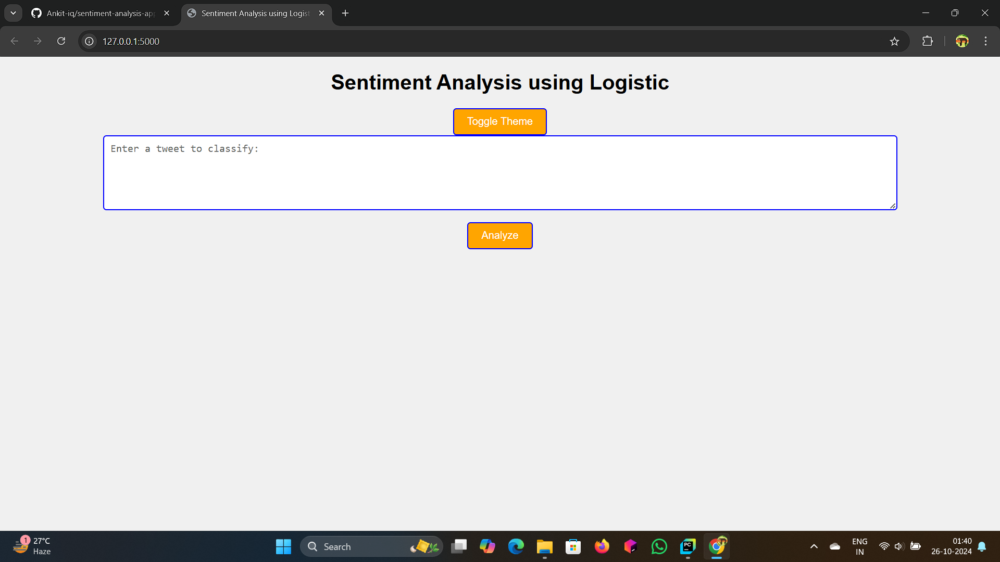

# Sentiment Analysis using Logistic Regression

 <!-- Add a relevant image here -->

## Table of Contents
- [Overview](#overview)
- [Features](#features)
- [Technologies Used](#technologies-used)
- [Installation](#installation)
- [Usage](#usage)
- [How It Works](#how-it-works)
- [Contributing](#contributing)
- [License](#license)

## Overview
This project is a web application that performs sentiment analysis on user-provided tweets using a Logistic Regression model. The application allows users to enter a tweet and receive instant feedback on its sentiment, with options to react using emojis.

## Features
- **Real-time Sentiment Analysis**: Get immediate predictions on the sentiment of your tweets.
- **Theme Toggle**: Switch between light and dark modes for a better user experience.
- **Emoji Reactions**: Express your feelings with emoji reactions to the sentiment prediction.
- **Responsive Design**: The application is designed to work seamlessly across different devices.

## Technologies Used
- **Flask**: A micro web framework for Python.
- **Pickle**: For loading machine learning models.
- **HTML/CSS**: For structuring and styling the web application.
- **JavaScript**: For adding interactivity, such as theme toggling and emoji reactions.

## Installation
1. Clone the repository:
    ```bash
    git clone https://github.com/Ankit-iq/sentiment-analysis-app.git
    cd sentiment-analysis-app
    ```
2. Install the required dependencies:
    ```bash
    pip install flask
    ```
3. Make sure you have the `model3.pkl` and `bow_counts_model3.pkl` files in the project directory.

## Usage
1. Run the Flask application:
    ```bash
    python Sentiment_Analyzer_app.py
    ```
2. Open your web browser and go to `http://127.0.0.1:5000/`.
3. Enter a tweet in the text area and click the **Analyze** button to see the sentiment prediction.

## How It Works
The application uses a pre-trained Logistic Regression model to classify the sentiment of tweets. When a user submits a tweet, the following happens:
1. The tweet is transformed into a Bag-of-Words representation.
2. The transformed data is passed to the model for prediction.
3. The sentiment (e.g., Positive, Neutral, Negative) is displayed on the screen along with emoji reaction options.

## Contributing
Contributions are welcome! If you have suggestions for improvements or want to report a bug, please create an issue or submit a pull request.

## License
This project is licensed under the MIT License - see the [LICENSE](LICENSE) file for details.

## Contact
For any inquiries or questions, please reach out:
- **Email**: [bhuyanankit048@gmail.com](mailto:bhuyanankit049@gmail.com)
- **GitHub**: [Ankit-iq](https://github.com/Ankit-iq)

---

Thank you for checking out my sentiment analysis project! I hope you find it useful. Feel free to explore and contribute!

